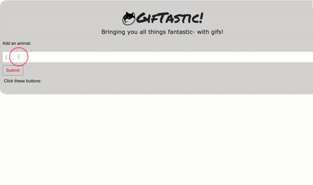

# GifTastic

This project demonstrates my knowledge on Ajax calls while using [Giphy](www.giphy.com)'s API to render gifs onto the HTML page using jQuery and Javascript. 

## Instructions
1. Search up your favorite animal in the search bar 
2. Click Submit
3. Click the appended button below and your gif will appear

When you submit your searches, they will always render below so you can go back to your previous search. The gif searches are not deleted so you can continue to click around to your heart's content. 

The gifs will show up to 15 searches and the ratings are displayed next to it. 

## Technology used
HTML, CSS, Bootstrap, Javascript, jQuery, and [Giphy](www.giphy.com) [API](https://api.giphy.com/v1/gifs/search?q)

Link to Giftastic: [click here](https://tracynle.github.io/GifTastic/)